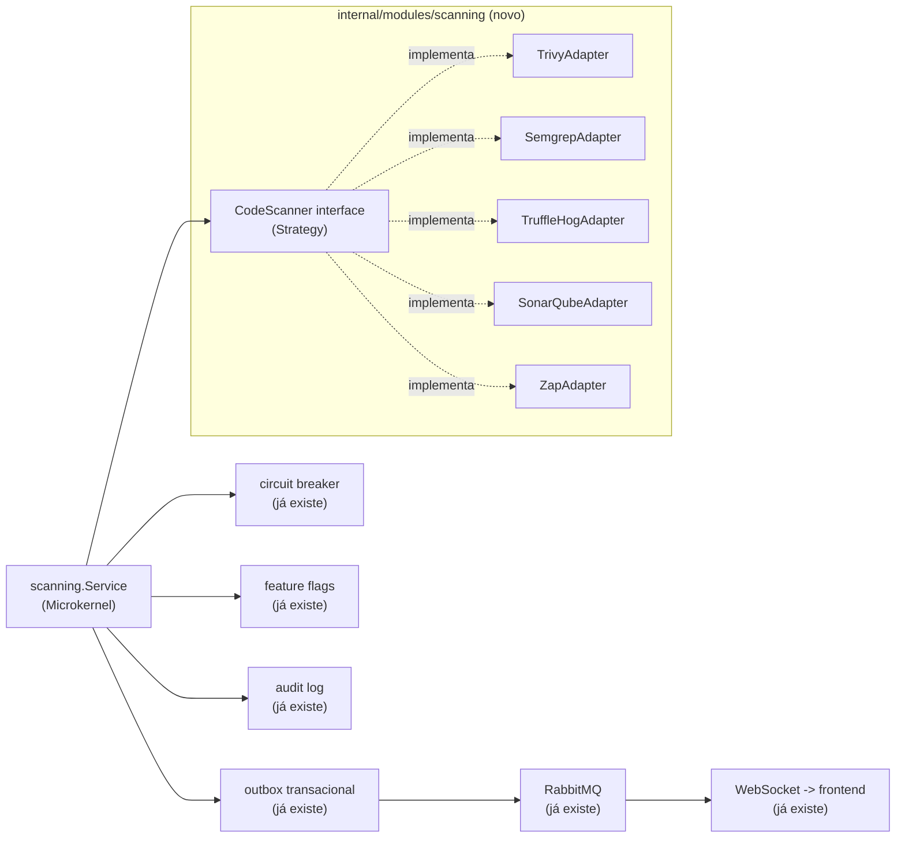

# Roadmap — SecOps Orchestrator: Trivy, Semgrep, TruffleHog, SonarQube e OWASP ZAP como parte do NIX Platform

- **Status:** Fases 1, 3-9 concluídas (Fundação, Trivy, Semgrep, SonarQube, OWASP ZAP, Orquestração
  concorrente, CLI + CI/CD, Frontend). Fase 2 (TruffleHog) pulada por decisão explícita do usuário,
  redundante com o gitleaks já no CI (decisão revisitada na Fase 11 abaixo — sob demanda deixou de
  ser redundante). **Fases 10-13 (abaixo) são uma extensão nova**, adaptação de uma segunda
  proposta externa ("Orquestrador de Segurança de Código On-Premise", estilo GitGuard) pra esta
  mesma arquitetura, com 3 decisões explícitas do usuário registradas na seção "Reconciliação" logo
  abaixo. **Fase 11 (Gitleaks + Syft) já implementada e verificada ao vivo; Fases 10/12/13 ainda
  não.** **"Containerização"** (uma quarta decisão, posterior às 3 — cada scanner isolado no próprio
  container, como o GitGuard) está **parcialmente implementada**: Trivy, Gitleaks e Syft migrados e
  verificados ao vivo (sidecars `trivy-scanner`/`gitleaks-scanner`/`syft-scanner`, volume
  compartilhado `scanning_workspace`); Semgrep/sonar-scanner CLI ainda rodam dentro do worker,
  migração futura seguindo o mesmo desenho.
- **Origem:** adaptação de uma proposta externa (Core em Go orquestrando ferramentas SecOps via
  Microkernel/Strategy/Adapter/Observer) para a arquitetura real deste repositório.
- **Revisão:** a primeira versão deste documento usava o módulo `secops`/VirusTotal como exemplo
  vivo de cada padrão já implementado. Esse módulo foi removido do produto (decisão do usuário —
  era a única integração "SecOps" real, e o rumo daqui pra frente é o orquestrador desenhado
  abaixo, não um provedor de lookup avulso). Os exemplos abaixo foram trocados para
  `diario_oficial`, o único módulo de integração restante — a arquitetura de plataforma que os
  patterns abaixo reaproveitam (outbox, circuit breaker, feature flags, auditoria) não mudou.

## Por que isto não é um "Core" novo — é uma extensão do que já existe

A proposta original pede um núcleo em Go do zero, gerenciando ferramentas de segurança como
plug-ins. O NIX Platform **já tem a espinha dorsal de plataforma** que isso precisa — o que não
existe mais é um exemplo vivo do papel específico de "Strategy" (não há mais um segundo provedor
plugável hoje, só `diario_oficial`, que fala com um único endpoint fixo) — mas a infraestrutura
em volta continua real e reaproveitável:

| Padrão pedido na proposta | Onde já existe no NIX Platform hoje |
|---|---|
| Strategy Pattern (interface comum por ferramenta) | ✅ Implementado: `scanning/domain/scanner.go` define `CodeScanner`, com `TrivyScanner` (Fase 3) como primeira implementação real registrada — não mais só o `fakeScanner` de teste. |
| Adapter Pattern (normalizar o output de cada ferramenta) | ✅ Implementado, quatro adapters reais: `trivy_scanner.go`, `semgrep_scanner.go`, `sonar_scanner.go` e `zap_scanner.go` traduzem a saída de cada ferramenta pro `domain.Finding` unificado — mesmo princípio que `diario_oficial/infrastructure/http_client.go` já aplicava a um único parceiro. O que os três primeiros têm em comum (clonar o alvo via git, validar SSRF) foi extraído pra `git_clone.go` em vez de duplicado; o `zap_scanner.go` é estruturalmente diferente (ataca um alvo HTTP em vez de ler código-fonte) e por isso não reaproveita esse arquivo — tem sua própria validação (allowlist obrigatória, ver Fase 6). |
| Observer / Event-Driven | Outbox transacional + RabbitMQ (`internal/platform/outbox`, `internal/domain/events`) já publicam `integration.status.changed`, `diario_oficial.job.completed/failed` e, desde a Fase 1/3, `scanning.scan.completed`/`scanning.scan.failed` — o consumer real hoje é só o Hub de WebSocket (`nix.notification.websocket`); nenhuma reação automática a achados CRITICAL/HIGH existe ainda. |
| Microkernel / plug-in registry | ✅ Implementado: `scanning.Service` recebe `...domain.CodeScanner` no construtor e monta um `map[string]CodeScanner` internamente — registrar uma ferramenta nova (Fase 4+) é só passar mais um argumento no wiring de `internal/app/modules.go`, sem tocar em `RunScan`/`ProcessScanJob`. |
| Resiliência (timeout, circuit breaker) | `internal/platform/resilience` (circuit breaker) e `context.Context` com timeout já protegem toda chamada externa — o mesmo mecanismo cobre um scanner novo sem código extra. |
| Interruptor de emergência por ferramenta | `internal/platform/configflags` (feature flags em runtime) já desliga uma integração inteira sem reimplantar — `diario_oficial_scraping_enabled` é o exemplo vivo hoje; cada scanner novo ganha sua própria flag do mesmo jeito. |
| Auditoria de cada execução | `internal/platform/audit` (log imutável) já registra toda ação sensível — cada scan vira uma entrada de auditoria como qualquer outra. |

**A diferença real que exige código novo:** um lookup de "essa entidade é maliciosa? sim/não"
(o que o `secops` removido fazia) cabe num resultado único. Trivy/Semgrep/TruffleHog/SonarQube
devolvem uma **lista** de achados discretos (um scan pode encontrar 40 vulnerabilidades, cada
uma com seu próprio CVE/arquivo/linha/severidade) — um formato estruturalmente diferente, que a
interface `CodeScanner` da Fase 1 já nasce pensando nisso, em vez de tentar encaixar numa forma
de resultado único.

## Arquitetura adaptada

Novo módulo `internal/modules/scanning` (mesmo padrão de pastas de todo módulo já existente:
`domain/application/infrastructure/transport`), com sua própria tabela (`scan_findings`),
suas próprias permissões RBAC (`scanning:read`, `scanning:manage`, seguindo o padrão já usado —
ver `internal/platform/auth/rbac.go`) e reaproveitando toda a plataforma já construída — nada
disso é modificado, só consumido:



`CodeScanner` (a interface nova, Fase 1):

```go
package scanning

type Severity string

const (
    SeverityCritical Severity = "CRITICAL"
    SeverityHigh     Severity = "HIGH"
    SeverityMedium   Severity = "MEDIUM"
    SeverityLow      Severity = "LOW"
)

// Finding é o modelo unificado de achado — todo adaptador converte o
// formato nativo da sua ferramenta (JSON/XML/SARIF) pra isto.
type Finding struct {
    ID          string   // CVE-2026-XXXX, ou uma regra própria (ex.: "semgrep:go.lang.security.audit.sql-injection")
    OWASPCategory string // "A03:2021-Injection", etc. — ver o mapeamento abaixo
    Severity    Severity
    Description string
    File        string // vazio para achados que não são de arquivo (ex.: DAST)
    Line        int
}

// CodeScanner é o contrato que toda ferramenta de scanning implementa —
// desenhado desde já pra "lista de achados" (não um resultado único),
// já que é isso que Trivy/Semgrep/TruffleHog/SonarQube/ZAP produzem.
type CodeScanner interface {
    Name() string
    Execute(ctx context.Context, target string) ([]Finding, error)
}
```

## Fases

Cada fase entrega algo testável e revertível por conta própria — nenhuma depende de todas as
ferramentas estarem prontas para gerar valor.

**Fase 1 — Fundação (sem ferramenta externa nenhuma ainda) — ✅ implementada**
- Migration `scan_findings` (id, scanner, target, owasp_category, severity, description, file,
  line, created_at) — mesmo padrão das tabelas já existentes
  (`migrations/000014_scan_findings.sql`).
- Interface `CodeScanner` + modelo `Finding` (acima) — `scanning/domain/scanner.go`, junto com
  `Repository` (persistência dos achados).
- `scanning.Service` (Strategy + Microkernel): recebe `map[string]CodeScanner` (registrado no
  construtor, um `panic` em nome duplicado — erro de wiring, não condição de runtime), roda um
  scan e grava achados + evento de outbox `scanning.scan.completed` numa única transação
  (`scanning/application/service.go`).
  - **Desvio deliberado do texto acima**: `RunScan` é **síncrono**, não o mesmo desenho
    assíncrono job+outbox+worker de `diario_oficial.Service.CreateTestJob`. O padrão assíncrono
    existe para desacoplar uma requisição HTTP de uma operação lenta via fila — mas esta fase não
    cria nenhum endpoint HTTP nem consumer de fila (ver abaixo), então um job/worker aqui seria
    infraestrutura morta: mensagens publicadas que nada consome. `RunScan` grava achados + evento
    de outbox atomicamente e retorna direto, sem fila no meio. A Fase 2, ao introduzir o primeiro
    scanner real chamado a partir de um endpoint HTTP de verdade, é o momento certo de revisitar
    essa escolha.
- Testado inteiramente com um `fakeScanner`, do mesmo jeito que
  `diario_oficial/application/service_test.go` já testa contra Postgres real com um `fakeClient`
  — nenhuma ferramenta externa precisa estar instalada para esta fase passar no CI
  (`scanning/application/service_test.go`, pulado sem `TEST_DATABASE_URL`).
- RBAC: `scanning:read`/`scanning:manage` adicionadas a `rbac.go`, concedidas a
  `nix-integration-manager` (leitura+gestão) e `nix-auditor` (só leitura) — o mesmo par de roles
  que já cobre integrações, em vez de um role novo só para isto.
- Auditoria: `audit.ActionScanCompleted` (`"scan.completed"`) registrado a cada `RunScan` bem-sucedido — a Fase 3 completou o trio com `ActionScanRequested`/`ActionScanFailed` para o fluxo assíncrono (ver abaixo).
- **Deliberadamente fora desta fase** (chegou na Fase 3, junto com o primeiro scanner real): nenhum
  endpoint HTTP/transport, nenhuma fila/worker RabbitMQ, nenhuma UI no frontend, e o módulo
  `scanning` não estava conectado em `internal/app/modules.go` — sem nenhum `CodeScanner` real
  ainda, conectar um `Service` sem scanner nem chamador teria sido abstração morta (o mesmo
  raciocínio que levou à remoção completa do módulo `secops`/VirusTotal). Ver Fase 3 abaixo para
  onde cada uma dessas peças foi de fato construída.

**Fase 2 — TruffleHog (secret scanning) — ⏭️ pulada por decisão do usuário**
- O CI deste projeto já roda [gitleaks](https://github.com/gitleaks/gitleaks)
  (`.github/workflows/gitleaks.yml`) — a mesma categoria de ferramenta que o TruffleHog. Diante da
  redundância, o usuário escolheu explicitamente ir direto para a Fase 3 (Trivy) em vez de adotar
  TruffleHog e aposentar o gitleaks. Fica registrada como decisão tomada, não como observação em
  aberto — se algum dia fizer sentido revisitar (ex.: TruffleHog cobre verificação ativa contra
  provedores conhecidos, gitleaks só regex), é aqui que essa fase retomaria.

**Fase 3 — Trivy (dependências, Dockerfiles) — ✅ implementada**
- **A suposição original desta fase estava errada e foi corrigida durante a implementação**: o
  texto original assumia que dava pra "reaproveitar o mesmo binário/imagem" que o Trivy já usa no
  CI. Investigando antes de implementar, descobriu-se que isso não é viável em produção: o
  `backend-worker` roda numa imagem Alpine mínima sem o código-fonte do repositório, sem acesso ao
  daemon Docker, e o CI nunca publica as imagens construídas em nenhum registry — não há de onde
  ler um Dockerfile ou uma imagem em tempo de execução sem antes obter o código de algum lugar.
  Perguntado sobre isso, o usuário escolheu explicitamente: **clonar o alvo via git** para um
  diretório temporário no worker e rodar `trivy fs` nele — em vez de montar o socket do Docker
  (superfície de ataque equivalente a root no host) ou publicar imagens num registry (escopo maior
  antes do Trivy em si funcionar).
- `TrivyScanner` (`backend/internal/modules/scanning/infrastructure/trivy_scanner.go`): alvo é
  `"<url-git-https>[#branch-ou-tag]"` — só `https://` é aceito (bloqueia `file://`, que permitiria
  ler qualquer caminho local do worker, e `ssh://`, que exigiria gerenciar uma chave privada), e o
  prefixo obrigatório garante por construção que o valor nunca começa com `-`, prevenindo injeção
  de argumento no `git`/`trivy` via `os/exec` (nunca via shell, mas real do mesmo jeito). Roda
  `trivy fs --scanners vuln,misconfig` (sem `secret` — gitleaks já cobre essa categoria no CI,
  mesmo raciocínio que decidiu a Fase 2 acima). Verificado de ponta a ponta contra um repositório
  público real (`OWASP/NodeGoat`) com 86 achados reais parseados corretamente.
- **A10 SSRF, corrigido durante a implementação**: este endpoint é o primeiro da plataforma a
  aceitar uma URL do chamador (o `target` git) — `validateHost` resolve o hostname e rejeita
  qualquer IP privado/loopback/link-local/não especificado antes de clonar, para que
  `scanning:manage` não vire um jeito de sondar/alcançar hosts internos a partir do worker. Defesa
  em profundidade, não uma proteção completa (o `git`, um processo separado, re-resolve o host de
  novo ao conectar de verdade — uma resposta de DNS que mude entre a checagem e essa conexão
  passaria batido), aceita como suficiente hoje porque quem chama já precisa do mesmo nível de
  confiança de qualquer outra ação administrativa de integração na plataforma. Ver a linha A10 na
  tabela OWASP abaixo.
- `git` instalado na imagem do `backend-worker` (nunca na do `backend-api`) — `trivy` em si **saiu**
  dessa imagem numa fase posterior (ver "Containerização" abaixo: o binário ganhou seu próprio
  container, `trivy-scanner`, chamado via HTTP). O checksum SHA-256 do binário contra o
  `checksums.txt` publicado pelo próprio projeto Trivy continua verificado antes de instalar —
  integridade de supply chain (A08:2021) — só que agora no `Dockerfile.trivy-sidecar`, não mais
  aqui.
- **Desvio deliberado do padrão síncrono da Fase 1**: com um scanner real e lento (clone + scan
  pode levar de segundos a minutos) chamado por HTTP de verdade, o par
  `CreateScanJob`/`ProcessScanJob` (mesmo desenho job+outbox+worker de
  `diario_oficial.Service.CreateTestJob`/`ProcessJob`) substitui a chamada síncrona só para o
  caminho HTTP — `RunScan` continua existindo, síncrono, para quem quiser chamar um scanner
  diretamente sem depender de fila (testes, uma futura execução agendada que já roda no worker).
  `POST /api/v1/scanning/scans` retorna 202 imediatamente; o `job_id` retornado é o mesmo `scan_id`
  usado depois em `GET /api/v1/scanning/scans/{scanID}/findings`.

**Fase 4 — Semgrep (SAST) — ✅ implementada**
- `SemgrepScanner` (`backend/internal/modules/scanning/infrastructure/semgrep_scanner.go`):
  exatamente como no exemplo da proposta original (`os/exec` chamando `semgrep scan --json`),
  convertendo pra `[]Finding`. Regras: `p/owasp-top-ten` (registry público, mantido pela
  comunidade Semgrep) como padrão, configurável via `SCANNING_SEMGREP_CONFIG`.
- **Reaproveitamento em vez de duplicação**: o mesmo alvo/mecânica do Trivy (clonar via git pra um
  diretório temporário) valia igualmente aqui — em vez de copiar `parseTarget`/`validateHost`
  (a defesa de SSRF da Fase 3) pro adapter novo, essa lógica foi extraída pra
  `git_clone.go`, compartilhada pelos dois scanners. Duplicar uma checagem de segurança em dois
  lugares é como ela diverge silenciosamente com o tempo — extrair antes do segundo uso evitou
  isso.
- **Duas descobertas reais ao integrar com a saída de verdade do Semgrep** (verificado rodando
  contra `OWASP/PyGoat`, um app Python deliberadamente vulnerável, não assumido da documentação):
  1. O campo `extra.metadata.owasp` tem **tipo inconsistente** entre regras da comunidade — às
     vezes uma lista de strings (`["A03:2021 - Injection", "A05:2025 - Injection"]`), às vezes uma
     string única (`"A06:2017 - Security Misconfiguration"`). `firstOWASPCategory` decodifica os
     dois formatos via `json.RawMessage`.
  2. `path` no resultado do Semgrep é **absoluto** (`/tmp/nix-scan-xxx/app.py`), ao contrário do
     `Target` do Trivy (já relativo) — `relativeToScanDir` corrige isso antes de gravar em
     `Finding.File`, pra nunca persistir um caminho efêmero que não significa nada fora da
     execução do scan.
- Severidade: o engine OSS do Semgrep só emite `ERROR`/`WARNING`/`INFO` (sem `CRITICAL` nativo,
  confirmado contra a saída real) — mapeado pra `HIGH`/`MEDIUM`/`LOW` respectivamente.
- `backend/Dockerfile.worker`: Python3 + pip + Semgrep instalados numa venv isolada só na imagem
  do worker. Diferença real de postura em relação ao Trivy, documentada no próprio Dockerfile: o
  Semgrep não publica um tarball com checksum próprio como o Trivy — a integridade aqui vem da
  cadeia padrão do pip contra o PyPI (TLS + hash por pacote), não de uma verificação explícita.
  Custo operacional real: a imagem do worker cresce de ~150MB pra **~916MB** com o runtime Python
  completo do Semgrep — aceito por ora; SonarQube (Fase 5) já é sinalizado como a fase de maior
  custo de infraestrutura da lista, mas o Semgrep também não é gratuito nesse sentido.

**Fase 5 — SonarQube (qualidade de código, bugs) — ✅ implementada**
- **Decisão de infraestrutura, explícita do usuário**: self-hosted via Docker Compose (não
  SonarCloud) — a única fase que não é "só chamar um binário." `docker-compose.yml` ganhou dois
  serviços novos: `sonarqube-db` (PostgreSQL dedicado — nunca compartilha schema com o `postgres`
  da aplicação, o SonarQube gerencia suas próprias migrations internamente) e `sonarqube`
  (`sonarqube:26.8.0.126808-community`, imagem pinada). Requisito documentado do próprio SonarQube
  (bootstrap check do Elasticsearch embutido): o host precisa de `vm.max_map_count >= 262144`
  (`sysctl -w vm.max_map_count=262144`) — não é namespaced por container, não dá pra setar via
  compose.
- **Diferença estrutural real em relação a Trivy/Semgrep, descoberta implementando**: os dois
  primeiros scanners rodam do início ao fim e devolvem o resultado completo no próprio stdout. O
  SonarQube é assíncrono em DOIS níveis — o `sonar-scanner` CLI só faz upload do relatório e
  retorna; o processamento de verdade (a "Compute Engine" do servidor) roda depois, em segundo
  plano. `SonarScanner.Execute`
  (`backend/internal/modules/scanning/infrastructure/sonar_scanner.go`) por isso: (1) roda o CLI
  (reaproveitando `cloneShallow`, a mesma validação de alvo/SSRF de Trivy/Semgrep), (2) lê o
  `ceTaskId` que o CLI grava em `.scannerwork/report-task.txt` (formato confirmado rodando contra
  um servidor real — não documentado explicitamente pelo SonarQube), (3) faz polling em
  `GET /api/ce/task?id=...` até `SUCCESS`/`FAILED`/`CANCELED`, e só então (4) busca os achados via
  `GET /api/issues/search`.
- **sonar-scanner CLI num runtime musl**: a imagem oficial `sonarsource/sonar-scanner-cli` é
  baseada em Amazon Linux (glibc) — copiar os binários nativos dela pra cima do Alpine (musl) do
  worker quebraria. Em vez disso, um estágio de build extra só extrai o JAR/script de shell
  portáveis dessa imagem (nenhum binário nativo), e o runtime final instala sua PRÓPRIA JRE nativa
  Alpine (`openjdk21-jre-headless`) — verificado rodando como o usuário `nix` não-root de verdade
  contra um servidor SonarQube real, sem erro de permissão.
- **Duas descobertas reais consultando a API do servidor de verdade** (não assumidas de
  documentação): (1) `/api/hotspots/search` exige uma permissão de leitura de projeto diferente da
  que um `GLOBAL_ANALYSIS_TOKEN` concede ("Insufficient privileges") — deliberadamente não
  buscado; hotspots exigem revisão humana pra decidir se são um problema de verdade, então tratá-los
  como `Finding` automático misrepresentaria "precisa de triagem" como "problema confirmado". (2)
  Esta versão (26.8, Community Edition) **não expõe mais um campo estruturado de mapeamento
  OWASP/CWE** em `/api/rules/show` nem `/api/rules/search` (só texto livre em HTML) — ao contrário
  do Trivy/Semgrep, `Finding.OWASPCategory` fica sempre vazio para achados do SonarQube.
  `project key` é derivado deterministicamente do alvo (mesmo repositório → mesmo projeto no
  SonarQube, histórico de análise acumulado entre scans).
- Severidade: escala legada de 5 níveis do SonarQube (BLOCKER/CRITICAL/MAJOR/MINOR/INFO, ainda o
  campo `severity` de todo issue na API atual) mapeada pra CRITICAL/CRITICAL/HIGH/MEDIUM/LOW.

**Fase 6 — OWASP ZAP (DAST) — ✅ implementada**
- **Maior risco de todas as fases, decisão explícita do usuário antes de implementar**: sem
  ambiente de staging/homologação real disponível, a verificação de ponta a ponta usou um alvo
  local — não um alvo público de teste (`testphp.vulnweb.com`, o candidato óbvio, mostrou-se
  inalcançável a partir deste ambiente durante a implementação; substituído por OWASP Juice Shop e
  nginx rodando localmente na mesma rede, especificamente pra este fim).
- **Diferença estrutural fundamental em relação a Trivy/Semgrep/SonarQube, refletida no próprio
  desenho do código**: os três primeiros só LEEM código-fonte — nunca interagem com o alvo além de
  clonar/enviar um relatório. O `ZapScanner`
  (`backend/internal/modules/scanning/infrastructure/zap_scanner.go`) ATIVAMENTE ATACA um serviço
  rodando de verdade (spider/crawl seguido de scan ativo — injeção, XSS, etc. — via a API REST de
  um daemon OWASP ZAP self-hosted, `docker-compose.yml` serviço `zap`). Por isso o alvo NUNCA passa
  por `cloneShallow`/`validateHost` (a defesa de SSRF dos outros três não faz sentido aqui — um IP
  privado é frequentemente o alvo LEGÍTIMO, um staging interno); a defesa central é uma
  **allowlist de hosts explícita e obrigatória** (`SCANNING_ZAP_ALLOWED_HOSTS`) — vazia por
  padrão, o oposto do "aberto por padrão" das outras validações desta plataforma: TODO alvo é
  recusado até um host de staging ser explicitamente autorizado. Nunca produção — regra
  inegociável, imposta em código (`validateTarget`), não só em documentação.
- **Descoberta real ao integrar com a API de um daemon real**: ao contrário do Trivy/Semgrep/
  SonarQube, o ZAP expõe um mapeamento OWASP Top 10 **estruturado de verdade** — cada alerta carrega
  tags como `OWASP_2021_A01` cujo valor é uma URL
  (`https://owasp.org/Top10/A01_2021-Broken_Access_Control/`), da qual `zapOWASPCategory` deriva o
  mesmo formato `"A01:2021-Broken Access Control"` que Trivy/Semgrep já usam. Um mesmo alerta pode
  carregar tags de 2017/2021/2025 simultaneamente (verificado contra a saída real) — só a 2021 é
  usada, pra bater com a edição que todo o resto deste roadmap já usa.
- Severidade: escala de 4 níveis do ZAP (High/Medium/Low/Informational — sem um nível acima de
  High, mesmo raciocínio que fez o Semgrep não usar CRITICAL) mapeada pra HIGH/MEDIUM/LOW/LOW.
- `docker-compose.yml`: serviço `zap` (`zaproxy/zap-stable:2.17.0`, daemon com API REST, autenticado
  por `api.key` obrigatório — sem chave, qualquer container na mesma rede poderia disparar
  ataques). Ao contrário de trivy/semgrep/sonar-scanner (processos rodados dentro do worker), o ZAP
  roda como um serviço de vida longa; o worker fala com a API dele via HTTP.

**Fase 7 — Orquestração concorrente — ✅ implementada**
- `POST /api/v1/scanning/scans` aceita `scanners` como uma **lista**, não mais um único nome — pedir
  mais de um (ex.: `["trivy","semgrep","sonarqube"]`) dispara todos em paralelo contra o mesmo
  alvo, sob o mesmo job/`scan_id`. Achados de todos os scanners bem-sucedidos ficam consultáveis
  juntos via `GET /api/v1/scanning/scans/{scanID}/findings`, cada um com seu próprio `scanner` no
  achado (já existia essa coluna — nenhuma migration nova precisou entrar).
- **Desvio deliberado do texto literal do roadmap**: `ProcessScanJob` usa `goroutines` +
  `sync.WaitGroup`, não o pacote `errgroup` como o texto original sugeria. Motivo: o comportamento
  padrão de `errgroup.Group.WithContext` cancela o contexto do grupo INTEIRO assim que o primeiro
  `Go()` retorna erro — exatamente o oposto do que esta fase pede ("cancelando um scanner que trava
  sem derrubar os outros"). Evitar esse cancelamento cruzado não é cosmético, é o que garante a
  independência entre scanners. Cada scanner já limita seu próprio tempo de execução por dentro
  (`CloneTimeout`, `SonarQubeAnalysisTimeout`, `ZapScanTimeout`) — não precisava de mais um nível de
  timeout aqui.
- **Falha parcial não é reprocessada**: se `N-1` de `N` scanners tiverem sucesso, o job é marcado
  `completed` (não `failed`) — reprocessar o job inteiro numa redelivery do RabbitMQ re-executaria
  também os scanners que JÁ tiveram sucesso, arriscando achados duplicados gravados sob o mesmo
  `scan_id`. O(s) scanner(s) que falhou(aram) fica(m) registrado(s) no `result` do job e nos
  metadados de auditoria (`failed_scanners`), nunca silenciosamente perdido(s). Só quando TODOS os
  scanners de um job falham é que o job inteiro é marcado `failed` para retry — mesma semântica de
  antes desta fase, agora generalizada pra N scanners em vez de 1.
- Testado com um scanner que bloqueia deliberadamente (prova de paralelismo real, não só "roda sem
  erro"), sucesso total, falha parcial (achados do scanner bem-sucedido persistidos, nada do que
  falhou) e falha total (job marcado pra retry) — `application/service_test.go`, mais um teste de
  ponta a ponta na camada de transporte confirmando os dois `scanner` distintos aparecendo juntos
  na resposta HTTP.

**Fase 8 — CLI + CI/CD — ✅ implementada**
- `cmd/secscan` (mesmo padrão de `cmd/api`/`cmd/worker`), chamável como
  `nix-secscan scan --repo . --scanners trivy,semgrep --fail-on HIGH` (ou `make secscan`). Ao
  contrário de `cmd/api`/`cmd/worker`, deliberadamente NÃO reaproveita `internal/app.NewDependencies`
  (que exige Postgres/RabbitMQ/Keycloak configurados) nem o padrão job+outbox+worker — é um binário
  standalone, síncrono, pra rodar uma vez e sair com um exit code (0 limpo, 1 achado no limiar de
  `--fail-on` ou mais grave, 2 erro de uso/ferramenta) que um pipeline de CI usa como gate.
- **Escopo desta fase, deliberado**: só `trivy` e `semgrep` — os dois únicos scanners que leem um
  diretório local sem depender de um servidor externo já no ar (`sonarqube` exige um servidor
  rodando e credenciais; `zap` nem se aplica, ataca um serviço vivo, não lê um diretório).
  `TrivyScanner`/`SemgrepScanner` ganharam um método novo, `ExecuteLocal(ctx, dir)`, que reaproveita
  a MESMA lógica de scan/parsing/mapeamento OWASP de `Execute` (usada pelo módulo `scanning` via
  HTTP) — só pula o `cloneShallow` (clonar de uma URL remota), já que o repositório já está no
  disco. Nenhuma duplicação de lógica entre o CLI e o módulo HTTP.
- **"Unifica" no sentido literal do roadmap**: `secscan` é um job NOVO e ADICIONAL em `ci.yml`
  (`--fail-on CRITICAL`, deliberadamente conservador pra não quebrar CI à toa) — os 4 jobs
  originais (govulncheck, npm audit, Trivy de imagem, gitleaks/CodeQL) continuam exatamente como
  estavam, nenhum removido. O valor real e imediato é reprodutibilidade local: `make secscan` roda
  o mesmo comando que o CI antes mesmo de abrir um PR.
- **Descoberta real testando** (não hipotética): rodar o CLI contra um checkout SEM git funcionando
  de verdade (ex.: um bind mount Docker com "dubious ownership") faz o semgrep perder sua
  consciência de `.gitignore` por padrão (`--use-git-ignore`, o comportamento default) e escanear
  artefatos de build tipo `frontend/.next` — ruído de código gerado/minificado, não código-fonte.
  `actions/checkout` no CI e um clone local normal sempre preservam a propriedade/o git funcional,
  então isto nunca acontece na prática — documentado no próprio `cmd/secscan/main.go` como uma
  premissa explícita, não contornado com flags de exclude extras que mascarariam o problema em vez
  de indicar que algo está errado com o checkout.
- Rodando `nix-secscan` contra o próprio NIX Platform, achados reais e genuínos apareceram — não
  simulados: `GO-2026-5932` (pacote `golang.org/x/crypto/openpgp`, não mantido, LOW) no
  `backend/go.mod`, `Dockerfile`s sem `HEALTHCHECK` (LOW), e — rodando contra `.github/workflows/`
  — toda action do próprio CI usando uma tag mutável (`@v4` em vez de um SHA de commit fixo,
  MEDIUM, um risco real de supply chain) e o `dependabot.yml` sem período de espera (`cooldown`)
  configurado. Nenhum desses foi corrigido nesta fase (fora de escopo — Fase 8 é sobre construir a
  ferramenta, não sanear todo achado que ela encontra), mas ficam registrados aqui como
  recomendações reais e verificadas pra quando fizer sentido agir sobre elas.

**Fase 9 — Frontend — ✅ implementada**
- Nova rota `/seguranca` (menu próprio na Sidebar, ícone `ShieldAlert`) — uma **seção própria**, não
  uma aba dentro de `/integracoes` (a opção que o roadmap deixava em aberto): dado o tamanho que o
  módulo `scanning` já tinha ganhado (quatro scanners reais, RBAC própria), o mesmo raciocínio que já
  tinha separado Integrações de Configurações nesta plataforma se aplicava aqui. Server Component
  puro (`app/(protected)/seguranca/page.tsx` + `loading.tsx`), reaproveitando `Table`/`Badge`/
  `EmptyState`/`ErrorState` do kit de UI já existente — nenhum componente novo além de um
  `SeverityBadge` fino (`Badge` com o tom mapeado por severidade), zero design novo.
- **Gap real de backend descoberto implementando**: o roadmap pede "achados recentes por
  severidade", mas até esta fase só existia `GET /api/v1/scanning/scans/{scanID}/findings`
  (escopado a um `scan_id` já conhecido) — nada permitia descobrir quais achados existem sem
  primeiro saber o `scan_id`. Endpoint novo: `GET /api/v1/scanning/findings?limit=N` (default 50,
  teto rígido 200), consultando `scan_findings` sem filtro de `scan_id`, mesma ordenação por
  severidade/data. RBAC reaproveitada (`scanning:read`, já existente).
- **`TriggerScanForm`, adicionado logo em seguida a pedido explícito do usuário** ("como
  mostraremos pra aplicação onde atacaremos?"): a versão original desta fase só listava achados,
  deliberadamente sem formulário de disparo. Um Client Component (`components/scanning/
  TriggerScanForm.tsx`) embutido na mesma página Server Component — seleção de scanner(s) via
  `Toggle` + campo de alvo via `Input`, `POST /api/v1/scanning/scans` pelo mesmo `apiClient`/proxy
  BFF que `IntegrationCard` já usa pro botão "Testar conexão". Explica no próprio texto do
  formulário a diferença de formato de alvo (URL git pros três primeiros scanners, URL http(s) de
  um serviço rodando pro ZAP) e que o ZAP só ataca um host já na allowlist
  (`SCANNING_ZAP_ALLOWED_HOSTS`).
- `NotificationCenter` ganhou tratamento para `scanning.scan.completed`/`scanning.scan.failed` —
  um gap real encontrado ao verificar o disparo pela UI: esses eventos já eram publicados desde a
  Fase 1, mas o frontend nunca tinha um toast pra eles. `scanning.scan.completed` tem tratamento
  próprio (como `integration.status.changed`) porque seu payload carrega `scan_id`, não `job_id`
  como o schema genérico de evento de job espera.
- Verificado de ponta a ponta contra o app de verdade: login real via NextAuth (fluxo de
  credenciais, não simulado), scan real disparado via API, página `/seguranca` buscada autenticada
  — achados reais (CVEs do OWASP/NodeGoat) renderizados com selo de severidade correto (43 CRITICAL,
  57 HIGH confirmados na resposta HTML) — e, depois, o formulário de disparo verificado pelo MESMO
  caminho que o clique do usuário percorre (proxy BFF autenticado por cookie de sessão, não um
  bearer token direto), criando um job real de verdade.

## Extensão — Projetos persistentes, Gitleaks, Syft, viewer de código, prompt de IA

Segunda proposta externa (ver histórico de conversa), desta vez inspirada no GitGuard: uma
aplicação "on-premise" com repositórios mantidos permanentemente em disco, upload de `.zip`,
suporte a repositório privado via PAT, 4 motores (Semgrep/Trivy/Gitleaks/Syft), deduplicação por
fingerprint, viewer de código-fonte na UI e um botão "copiar prompt pra IA" por achado. Boa parte
já existe (ver tabela); o resto é adaptado abaixo — nunca implementado literalmente como a proposta
descreve quando isso colidia com uma decisão de arquitetura já tomada e documentada neste roadmap.

### O que a proposta pede que já existe hoje, sem mudança nenhuma

| Pedido da proposta | Onde já existe |
|---|---|
| Orquestração paralela de scanners via goroutines | ✅ `runConcurrently` (Fase 7) — e mais robusto que o texto da proposta: `sync.WaitGroup` puro, não `errgroup` (ver Fase 7, o cancelamento cruzado do `errgroup` seria regressão) |
| Severidade normalizada CRITICAL/HIGH/MEDIUM/LOW | ✅ `domain.Severity`, desde a Fase 1 — a MESMA escala que a proposta pede |
| Ferramenta de origem + arquivo:linha em cada achado | ✅ `Finding.Scanner`/`File`/`Line`, desde a Fase 1 |
| "Card mostra qual ferramenta achou, tipo de erro, como corrigir" | ✅ `remediationHint`/`ScannerFailureCard`/`FindingsTable` (sessão anterior) — inclusive já com link "abrir na ferramenta" (`ToolResponse.URL`), algo que a proposta nem pede |
| Rodar scanner direto contra um diretório LOCAL (sem clonar) | ✅ `TrivyScanner.ExecuteLocal`/`SemgrepScanner.ExecuteLocal` (Fase 8, `cmd/secscan`) — exatamente o método que as Fases 11/12 abaixo reaproveitam pra ler do disco em vez de clonar de novo |
| Interface comum por ferramenta (Strategy) | ✅ `domain.CodeScanner` — Gitleaks/Syft (Fase 11) são só mais dois adapters, mesmo padrão de `TrivyScanner`/`SemgrepScanner` |

### Reconciliação — as 3 decisões do usuário

1. **Armazenamento em disco:** a proposta pede repositórios persistidos permanentemente em
   `./storage/repos/{project_id}`, com `git pull` pra re-scan. **Decisão: não.** O worker sempre
   clona pra um diretório TEMPORÁRIO e apaga logo depois de cada scan (`cloneShallow`,
   `git_clone.go`) — deliberado desde a Fase 3, e o motivo continua válido: o worker já é desenhado
   pra escalar horizontalmente via consumer RabbitMQ (múltiplas réplicas), e "qual réplica tem a
   pasta de qual projeto no disco local dela" é um problema de estado que checkout persistente
   introduziria sem necessidade — resolvê-lo direito exigiria storage compartilhado em rede (EFS/NFS
   ou similar), escopo bem maior que o valor real do pedido ("re-scan mais rápido"). Em vez disso: a
   **Fase 10** abaixo introduz "Projeto" como um registro leve (nome, alvo, histórico de scans) —
   sem persistir o checkout em si. Um re-scan continua clonando do zero (o mesmo custo de rede que
   todo scan já paga hoje, pequeno pra shallow clone) — só ganha a conveniência de não precisar
   colar a URL de novo.
2. **PAT / repositório privado:** a proposta pede um campo de Personal Access Token pra clonar
   repositórios privados. **Decisão: não, por enquanto.** Aceitar credencial do usuário é uma
   superfície de segurança nova que este roadmap nunca teve (guardar segredo com segurança, nunca
   deixar vazar em log/mensagem de erro do `git`, decidir quem pode ver/rotacionar) — desproporcional
   ao resto da proposta, que dá pra entregar inteiro sem isso. `parseGitTarget` continua exigindo
   `https://` público, exatamente como hoje (Fase 3). Fica registrado aqui como possível fase futura,
   não como esquecimento.
3. **Gitleaks e Syft:** a proposta pede os dois. O roadmap já tinha decisão explícita contra ambos —
   Gitleaks pulado na Fase 2 (redundante com o gitleaks do CI) e SBOM listado em "Fora de escopo"
   (abaixo) como "projeto à parte". **Decisão: adicionar os dois agora**, revisitando as duas
   decisões — o contexto mudou: CI gitleaks só cobre o que está em PRs/commits deste próprio
   repositório; um Gitleaks sob demanda pela UI do orquestrador cobre QUALQUER alvo que o usuário
   aponte, o mesmo raciocínio que já vale pra Trivy/Semgrep/SonarQube não serem "redundantes" com o
   CI mesmo o CI já rodando `govulncheck`/`npm audit`. Ver Fase 11.

### Containerização — cada scanner isolado no próprio container — 🟡 parcial (Trivy, Gitleaks e Syft feitos)

Decisão do usuário, depois das 3 acima: **"o gitguard usa cada solução containerizada, vamos fazer
do mesmo jeito"**. Antes desta decisão, Trivy/Semgrep/(sonar-scanner CLI) rodavam como binários
instalados DENTRO da imagem do `backend-worker`, chamados via `os/exec` — SonarQube e ZAP já eram
diferentes (serviços de vida longa próprios, `docker-compose.yml`), mas por acaso de arquitetura
(os dois precisam mesmo de um servidor), não por uma decisão deliberada de isolamento. Agora é
deliberado: **todo scanner vira um serviço próprio**, um container isolado com API HTTP fina na
frente — o mesmo padrão que SonarQube/ZAP já tinham, generalizado.

**Por que não montar o socket do Docker** (a forma mais óbvia de fazer o worker literalmente rodar
`docker run trivy ...`): a Fase 3 já rejeitou isso explicitamente pro caso de ler imagens Docker —
"superfície de ataque equivalente a root no host". O mesmo raciocínio vale igual aqui; escolhido em
vez disso o desenho abaixo, que nunca dá ao worker acesso ao Docker em si.

**Desenho, estabelecido implementando o Trivy (o primeiro, referência pros próximos)**:
- Volume Docker nomeado novo, `scanning_workspace`, montado em `/workspace` — leitura+escrita no
  `backend-worker` (que continua sendo o único dono do ciclo de vida: cria o diretório antes do
  scan, apaga depois), **somente leitura** em cada sidecar de scanner (defesa em profundidade: um
  sidecar comprometido não consegue adulterar o clone que outro scanner ainda vai ler).
- `cloneShallow` (`git_clone.go`, compartilhada entre Trivy/Semgrep/SonarQube) ganhou um parâmetro
  `baseDir` — `""` continua o padrão de sempre (diretório temporário do próprio SO, usado por
  Semgrep/SonarQube, ainda não containerizados); só `TrivyScanner.Execute` passa
  `ScanningConfig.ScanningWorkspaceDir` (`/workspace` em produção), pra clonar dentro do volume
  compartilhado em vez do filesystem privado do worker.
- Sidecar novo, `cmd/trivy-sidecar` (`backend/Dockerfile.trivy-sidecar`, serviço `trivy-scanner` no
  `docker-compose.yml`): um servidor HTTP fino — `POST /scan {"path": "..."}` roda
  `trivy fs --format json ...` contra esse path e devolve o JSON NATIVO do trivy, sem reinterpretar
  nada. Recusa (400) qualquer `path` fora de `/workspace` — nunca confia cegamente no que a rede
  interna mandou, mesma postura de `validateHost` pro alvo git. Todo o parsing/mapeamento
  OWASP/normalização de severidade (`parseTrivyReport`) continua em `trivy_scanner.go`, no worker —
  nunca duplicado no sidecar.
- `TrivyScanner.Execute` (produção, via worker) chama o sidecar por HTTP;
  `TrivyScanner.ExecuteLocal` (`cmd/secscan`, o CLI standalone da Fase 8) continua rodando o binário
  local via `os/exec`, sem depender de rede nenhuma — os dois caminhos convergem no mesmo
  `parseTrivyReport`, então o formato do achado nunca diverge entre eles.
- **Achado real durante a implementação**: um volume Docker nomeado novo nasce `root:root` — o
  worker (rodando como usuário não-root `nix`) não conseguia criar o diretório do clone
  (`permission denied`), reproduzido ao vivo contra um scan de verdade antes de corrigir. Fix: os
  dois Dockerfiles (`Dockerfile.worker` e `Dockerfile.trivy-sidecar`) passaram a usar um UID/GID
  FIXO (`10001`), idêntico nos dois, e pré-criam `/workspace` com essa ownership ANTES do volume ser
  montado — Docker copia a ownership que já existe nesse caminho dentro da imagem pro volume vazio
  na primeira vez que ele é montado, então qualquer um dos dois containers pode ser o primeiro a
  subir sem deixar o volume com o dono errado.
- Verificado ao vivo, ponta a ponta: um scan de verdade contra `OWASP/NodeGoat` via o sidecar achou
  os MESMOS 86 achados que a Fase 3 original (antes da containerização) já tinha registrado — prova
  de que a migração não mudou nenhum resultado, só onde o binário roda. O caminho de erro também
  verificado (alvo inexistente) — a mensagem real do `git clone` (capturada no worker, antes de
  qualquer chamada ao sidecar) continua chegando íntegra até a UI.
- Imagem do `backend-worker` caiu de ~982MB pra bem menos sem o binário do trivy (ainda carrega
  semgrep+sonar-scanner+JRE, os próximos candidatos a sair); `trivy-scanner` como imagem própria
  fica em ~243MB, só o necessário pro Trivy rodar.

**Gitleaks e Syft (Fase 11) já nasceram seguindo este mesmo desenho**, sem precisar de uma migração
posterior: `cmd/gitleaks-sidecar`/`Dockerfile.gitleaks-sidecar`/serviço `gitleaks-scanner` e
`cmd/syft-sidecar`/`Dockerfile.syft-sidecar`/serviço `syft-scanner`, mesmo UID/GID fixo (`10001`)
em todos os Dockerfiles, mesma validação de path dentro de `/workspace`. Syft é o único caso em que
o método chamado pelo Service não é `Execute` — é `Inventory` (`domain.InventoryProvider`, ver Fase
11 abaixo), já que `Execute` em si nunca faz nada pra este scanner. Ver Fase 11 abaixo pro que só o
Gitleaks precisou de ajuste (o achado real do path com o diretório de clone embutido, corrigido em
`parseGitleaksReport`).

**Ainda não migrados pro mesmo padrão** (trabalho futuro, mesmo desenho, scanner por scanner):
Semgrep (`semgrep_scanner.go`, ainda `os/exec` dentro do worker) e o `sonar-scanner` CLI em si
(`sonar_scanner.go` — o SERVIDOR SonarQube já é seu próprio container desde a Fase 5, só o CLI que
faz upload ainda roda dentro do worker). Syft (Fase 11, sidecar `syft-scanner`) já nasceu seguindo
este padrão desde o design, sem precisar de uma migração depois — mesmo `Dockerfile`/UID-fixo/
healthcheck que Trivy/Gitleaks.

### Fase 10 — Projeto como entidade própria + upload `.zip` — 🔲 não implementada

- Migration nova: `scanning_projects` (id, name, target, created_at) — tabela própria do módulo
  `scanning`, mesmo princípio de `scan_findings`/`scanning_scanner_runs` (nunca uma coluna a mais
  na tabela `jobs` genérica compartilhada com `diario_oficial`).
- `scanJobPayload` (`application/service.go`) ganha `ProjectID *uuid.UUID` opcional — um scan
  disparado "avulso" (sem projeto, o fluxo atual) continua funcionando sem mudança; um scan
  disparado a partir da tela de um projeto carrega o `ProjectID`, e o histórico desse projeto é
  "todo job cujo payload tem esse `project_id`" (mesmo padrão de consulta que `ListRecentScans` já
  usa, um filtro a mais).
- `POST /api/v1/scanning/projects` cria um projeto (nome + alvo git, validado pelo MESMO
  `parseGitTarget`/`validateHost` que scan avulso já usa — nenhuma validação nova). Alvo git
  continua só `https://` público (decisão 2 acima).
- **Upload `.zip`, a peça genuinamente nova**: `POST /api/v1/scanning/projects` aceita também
  `multipart/form-data` com um arquivo `.zip` em vez de um alvo git — o handler extrai pra um
  diretório TEMPORÁRIO (mesmo ciclo de vida do clone: existe só durante o scan, apaga depois),
  valida que a extração não escreve fora do diretório de destino (defesa contra "zip slip" — um
  `../../etc/cron.d/x` dentro do `.zip`, a mesma classe de ataque que `validateHost` já previne pro
  caso do git/SSRF, adaptada pra path em vez de host) e roda `TrivyScanner.ExecuteLocal`/
  `SemgrepScanner.ExecuteLocal`/`GitleaksScanner.ExecuteLocal` (Fase 11) direto nele — os MESMOS
  métodos que `cmd/secscan` já usa pra ler um diretório local, reaproveitados, não duplicados. Um
  projeto criado por upload nunca tem alvo git — `sonarqube`/`zap` ficam indisponíveis pra ele (o
  primeiro exige `git clone` pra derivar a project key, o segundo nem se aplica, ataca um serviço
  vivo).
- Frontend: `/seguranca` ganha uma terceira seção "Projetos" (cards, mesmo padrão de
  `ToolFindingsCards`/`IntegrationCard` — nunca uma tabela nova), cada card com nome + alvo + status
  do último scan + botão "Rodar de novo" (dispara `POST /api/v1/scanning/scans` com o `ProjectID` já
  preenchido, sem pedir a URL de novo). Formulário de criação com duas abas (URL git / upload
  `.zip`), exatamente como a proposta pede na seção 5.A.

### Fase 11 — Gitleaks e Syft como `CodeScanner` novos — ✅ implementada

- `GitleaksScanner` (`infrastructure/gitleaks_scanner.go`) — **✅ implementado e verificado ao
  vivo**: mesmo esqueleto do `TrivyScanner` JÁ CONTAINERIZADO (ver "Containerização" acima) —
  `Execute` clona via `cloneShallow` pro volume `scanning_workspace` compartilhado (reaproveita a
  validação de SSRF já compartilhada) e chama o sidecar `cmd/gitleaks-sidecar`
  (`Dockerfile.gitleaks-sidecar`, serviço `gitleaks-scanner`) via HTTP, nunca rodando o binário
  dentro do próprio worker; `ExecuteLocal` roda o binário local via `os/exec`, sem rede — usado só
  por `cmd/secscan`/upload `.zip` (Fase 10, ainda não implementada), continua sem chamador de
  produção por ora, mesmo como `TrivyScanner.ExecuteLocal` antes da Fase 8 existir. Roda
  `gitleaks detect --source {path} --no-git --report-format json --report-path /dev/stdout
  --exit-code 0` — `--exit-code 0` (não estava no texto original desta fase, ajuste real feito
  durante a implementação): gitleaks sai com 1 por padrão quando ACHA um segredo, o que não é uma
  falha da ferramenta; forçar sempre 0 mantém o branch de erro do sidecar só pra falha de verdade
  (path inválido, binário quebrado), mesmo princípio de exit-code que `cmd/secscan` já aplicava pro
  `trivy`. **Achado real durante a verificação ao vivo** (não hipotético): diferente do trivy, que
  já devolve `Target` relativo, o gitleaks devolve `File` com o `--source` completo embutido (ex.:
  `/workspace/nix-scan-3216795497/new_key`) — sem tratamento, o nome do diretório de clone efêmero
  vazaria pro achado mostrado ao usuário; `parseGitleaksReport` agora recebe o diretório base e
  remove esse prefixo (coberto por `TestParseGitleaksReport_StripsBaseDirFromFile`).
  Verificado contra um repositório público real com segredos de teste conhecidos
  (`trufflesecurity/test_keys`) — 3 achados reais (`aws-access-token`, `generic-api-key`,
  `private-key`), rodando em paralelo com o Trivy no mesmo scan sem conflito no volume
  compartilhado.
- **Ajuste feito** (o mesmo que este roadmap já previa): com Gitleaks cobrindo secrets sob demanda,
  `TrivyScanner` continua sem `--scanners secret` — o comentário em `trivy_scanner.go` foi
  atualizado pra apontar pro `GitleaksScanner` sob demanda como o motivo real da exclusão, não mais
  só "o CI já roda gitleaks" (que continua verdade, mas não é o motivo desta exclusão específica).
- Severidade: Gitleaks não tem campo de severidade nativo (é binário — achou um segredo ou não) —
  todo achado do Gitleaks mapeia pra `CRITICAL` (um segredo commitado é sempre grave, nunca um
  "talvez"; mesmo padrão de decisão que já mapeou a ausência de nível acima de HIGH do ZAP/Semgrep
  pra escalas mais simples). Categoria OWASP: `A07:2021-Identification and Authentication
  Failures` — onde o próprio mapeamento oficial do OWASP Top 10 2021 associa CWE-798 (Use of
  Hard-coded Credentials).
- Segredo em claro nunca persiste: `Finding.Snippet` do Gitleaks guarda só as bordas do match
  mascaradas (`maskSecretSnippet` — ex.: `AKI***********PLE`), nunca o valor completo — o próprio
  achado não pode virar um novo vazamento em log, resposta de API ou tela.
- `SyftScanner` (`infrastructure/syft_scanner.go`) — **✅ implementado e verificado ao vivo**:
  **estruturalmente diferente dos outros 5** — os outros produzem `[]Finding` (uma
  vulnerabilidade/achado é sempre acionável, algo pra corrigir); Syft produz um **inventário**
  (lista de pacotes/versões), não achados de segurança por si só. Não força esse inventário dentro
  de `domain.Finding` (perderia a informação real, um pacote não é um "erro"). Em vez disso,
  `CodeScanner` ganha um segundo método OPCIONAL:
  ```go
  // Inventory é implementado só por scanners que produzem inventário, não
  // achados — hoje só Syft. Um type assertion (`scanner.(domain.InventoryProvider)`)
  // no Service decide se um scanner participa do fluxo de achados, do de
  // inventário, ou dos dois — nunca uma interface CodeScanner maior que a
  // maioria dos scanners não teria como implementar de verdade.
  type InventoryProvider interface {
      Inventory(ctx context.Context, target string) ([]Package, error)
  }
  ```
  Implementação real: `SyftScanner.Execute` é sempre um no-op (`return nil, nil` — nunca clona
  nada, nunca aparece na lista de achados de nenhum scan); todo o trabalho acontece em `Inventory`,
  chamado à parte pelo `Service` (`application/service.go`'s `inventoryFor`, via a mesma type
  assertion do trecho acima) logo depois de `Execute` — tanto em `runConcurrently`
  (`ProcessScanJob`, o caminho assíncrono) quanto em `RunScan` (o caminho síncrono). Mesmo desenho
  containerizado do Gitleaks: `Inventory` clona pro volume `scanning_workspace` e chama o sidecar
  `cmd/syft-sidecar`/`Dockerfile.syft-sidecar`/serviço `syft-scanner` via HTTP (`syft scan dir:{path}
  -o json`, o formato JSON nativo do syft — `artifacts[].name/version/type/licenses[].value`);
  `InventoryLocal` roda o binário local via `os/exec`, sem chamador de produção ainda (mesmo estado
  que `TrivyScanner.ExecuteLocal` tinha antes da Fase 8).
  Nova tabela `scan_packages` (scan_id, name, version, type, license), persistida na MESMA transação
  de `SaveFindings`/o evento de outbox (`persistCompletion`) — um scan concluído nunca fica com
  achados gravados e inventário perdido, ou vice-versa. Consultável via
  `GET /api/v1/scanning/scans/{scanID}/packages` (rota nova, `ListPackagesByScanID`), exibida na aba
  "Inventário (SBOM)" da página de um scan (`/seguranca/[scanId]`, `PackageInventoryTable` — só
  aparece quando o scan de fato pediu "syft", nunca uma seção vazia à toa), ao lado de "Achados por
  ferramenta" (Fase 9), nunca misturada na mesma lista/tabela.
  Verificado contra um repositório público real com dependências de verdade (`OWASP/NodeGoat`) — 419
  pacotes reais persistidos e consultáveis via a API (`npm`/`github-action`, nome/versão/licença
  corretos), `findings_count: 0` no mesmo scan (confirma que Syft nunca aparece como achado).
- RBAC: nenhuma permissão nova — `scanning:read`/`scanning:manage` já cobrem os três scanners
  novos, mesmo princípio de Trivy/Semgrep/SonarQube/ZAP.

### Fase 12 — Snippet de código no achado + deduplicação — 🔲 não implementada

- **A proposta pede um endpoint `GET /api/file-content` pra ler o arquivo do disco sob demanda na
  UI — incompatível com a decisão 1 acima** (sem checkout persistente, não há arquivo no disco
  depois que o scan termina e a pasta temporária é apagada). Adaptação: em vez de ler o arquivo
  DEPOIS, sob demanda, `Finding` ganha um campo `Snippet` capturado NO MOMENTO do scan, enquanto o
  clone temporário ainda existe — cada adapter (`Trivy`/`Semgrep`/`Gitleaks`) lê ~5 linhas antes/depois
  de `Finding.Line` do próprio arquivo já aberto durante o parsing do resultado, antes de
  `cloneShallow` limpar o diretório. Entrega o mesmo valor real da proposta ("ver o código da
  vulnerabilidade sem abrir o repositório") sem precisar manter nada em disco depois — o preço é não
  dar pra navegar o repositório inteiro livremente (só o trecho de cada achado específico), que
  nunca foi pedido além do contexto de UM achado por vez na proposta original (seção 5.B: "renderiza
  o arquivo... com destaque na linha", sempre no contexto de UM achado expandido).
- Migration: `scan_findings` ganha coluna `snippet TEXT NOT NULL DEFAULT ''` — achados antigos
  (antes desta fase) ficam com snippet vazio, `FindingsTable`/Dialog tratam isso mostrando só "sem
  trecho disponível" em vez de quebrar.
- **Deduplicação por fingerprint**: `Finding` ganha `Fingerprint` — SHA-256 de
  `scanner + finding_id + file + line`, calculado em `toFindingResponse` (Go) ou já no momento de
  gravar (mais barato calcular uma vez que a cada leitura — decisão: calcular em `SaveFindings`,
  gravar a coluna). Não deduplica DENTRO de um scan (cada linha de `scan_findings` já é um achado
  distinto por natureza) — deduplica ENTRE re-scans do MESMO projeto (Fase 10): a UI do histórico de
  um projeto mostra "achado X apareceu pela primeira vez no scan de 12/08, ainda presente no scan de
  20/08" em vez de listar a mesma vulnerabilidade repetida uma vez por scan.

### Fase 13 — Filtro de ruído + botão "Copiar prompt pra IA" — 🔲 não implementada

- Filtro de ruído por caminho (`/tests/`, `/fixtures/`, `*_test.go`, `.env.example`, etc.):
  **configurável, não hardcoded** — um achado real de segredo commitado dentro de um arquivo de
  teste ainda É um segredo real (Gitleaks, por design, não distingue "teste" de "produção"; um
  `.env.example` com uma chave de exemplo que por acaso é uma chave de verdade já vazada é
  exatamente o tipo de coisa que não deveria sumir silenciosamente). Lista de padrões de exclusão
  vira uma feature flag configurável (`internal/platform/configflags`, mesmo mecanismo que já
  desliga `diario_oficial_scraping_enabled` em runtime) — desligada por padrão (mostra tudo, como
  hoje), habilitável por quem administra a instância.
- Botão "Copiar prompt pra IA" em cada achado (`FindingsTable`'s Dialog, ao lado de "Como
  corrigir"): monta o markdown exatamente como a proposta especifica (seção 5.C), mas incluindo
  também `remediationFor()` (o hint por categoria OWASP que este roadmap já gera, Fase 9 anterior) —
  contexto a mais que a proposta não tinha porque não existia antes disso ser construído. Cópia via
  `navigator.clipboard.writeText` (API do navegador, nenhuma dependência nova) — mesmo princípio de
  zero-novo-design que todo componente desta seção já segue.

## Mapeamento OWASP Top 10 — o que já é real hoje vs. o que este roadmap adiciona

| Risco | Já implementado no NIX Platform hoje | O que este roadmap adiciona |
|---|---|---|
| A01 Broken Access Control | RBAC por permissão (`RequirePermission`), rotas sensíveis protegidas | ✅ ZAP (scan ativo, allowlist de staging obrigatória) via `POST /api/v1/scanning/scans` (Fase 6) |
| A02 Cryptographic Failures | RS256 próprio pro login local, bcrypt, segredos via `_FILE`, HSTS | — (já coberto; scanners não mudam isso) |
| A03 Injection | 100% consultas parametrizadas via pgx (conferido nesta sessão: zero concatenação de string em SQL) | ✅ Semgrep (`p/owasp-top-ten`, taint analysis, Fase 4) + SonarQube (issues do tipo `VULNERABILITY`, Fase 5) via `POST /api/v1/scanning/scans` |
| A04 Insecure Design | Monólito modular com fronteiras de módulo, ADRs documentando decisão de arquitetura | — (prática de engenharia, não uma ferramenta) |
| A05 Security Misconfiguration | CSP com nonce, headers de segurança, containers non-root | ✅ Trivy (`--scanners misconfig`) varrendo Dockerfiles sob demanda, via `POST /api/v1/scanning/scans` (Fase 3) |
| A06 Vulnerable Components | govulncheck + npm audit + Trivy (imagens) + Dependabot, todos já no CI | ✅ Trivy (`--scanners vuln`) sob demanda contra qualquer repositório git, fora do CI (Fase 3) |
| A07 Auth Failures | Bloqueio de conta, rate limit distribuído, erro genérico (sem enumeração de usuário) | ✅ ZAP testando o ciclo de vida de sessão em staging (Fase 6) |
| A08 Software & Data Integrity | Idempotência, outbox transacional, CI builda a partir do código-fonte | ✅ Syft (inventário SBOM, Fase 11 — "Extensão" acima) sob demanda; assinatura digital de artefato (`cosign`) continua fora de escopo (ver "Fora de escopo") |
| A09 Logging & Monitoring | Audit log imutável, logs estruturados correlacionados por request id, Prometheus, OpenTelemetry | `scanning.scan.completed` como mais um evento auditado (Fase 1) |
| A10 SSRF | ⚠️ Desde a Fase 3, `POST /api/v1/scanning/scans` (target de `trivy`, `semgrep` **e**, desde a Fase 5, `sonarqube` — os três reaproveitam a mesma validação via `git_clone.go`) É um endpoint que aceita uma URL do chamador — `validateHost` resolve o host e rejeita IP privado/loopback/link-local/não especificado antes de clonar, defesa em profundidade (não uma proteção completa contra DNS rebinding, já que o `git` re-resolve o host ao conectar; aceito hoje porque quem chama já precisa de `scanning:manage`). Todo outro endpoint continua sem aceitar URL arbitrária. | ✅ Semgrep + SonarQube (Fases 4/5) já rodam contra os próprios módulos da plataforma sob demanda — detectariam um cliente HTTP com URL não validada se esse padrão aparecesse no futuro |

## Fora de escopo deste roadmap

- **Assinatura digital de artefatos** (`cosign` ou similar, A08) — diferente de SBOM/Syft (agora em
  escopo, Fase 11): assinar/verificar artefato de build é um projeto de supply-chain à parte, não
  uma fase natural deste orquestrador de scanning.
- **Repositório privado / PAT** — decisão explícita do usuário (ver "Reconciliação" acima, item 2):
  superfície de segurança nova (guardar/rotacionar credencial) desproporcional ao resto da proposta.
  Fica registrado como possível fase futura, não como esquecimento.
- **Checkout de repositório persistido em disco** — decisão explícita do usuário (ver
  "Reconciliação" acima, item 1): o worker escala horizontalmente via RabbitMQ, e persistir um
  checkout local por projeto reintroduziria um problema de estado por réplica que o desenho atual
  (clone efêmero, temporário, apagado após cada scan) evita de propósito. "Projeto" (Fase 10) é
  metadado — nome, alvo, histórico — nunca o checkout em si.
- Qualquer execução automática deste roadmap nesta sessão — este documento é o planejamento;
  implementação começa quando o usuário escolher uma fase.
