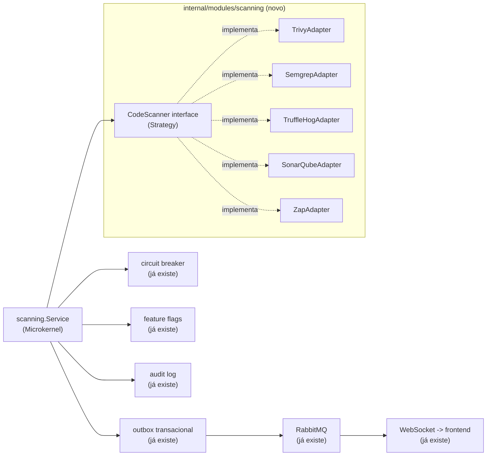

# Roadmap — SecOps Orchestrator: Trivy, Semgrep, TruffleHog, SonarQube e OWASP ZAP como parte do NIX Platform

- **Status:** proposto — nenhuma fase abaixo está implementada ainda. Este documento é o
  planejamento; a decisão de qual fase atacar primeiro é do usuário.
- **Origem:** adaptação de uma proposta externa (Core em Go orquestrando ferramentas SecOps via
  Microkernel/Strategy/Adapter/Observer) para a arquitetura real deste repositório.

## Por que isto não é um "Core" novo — é uma extensão do que já existe

A proposta original pede um núcleo em Go do zero, gerenciando ferramentas de segurança como
plug-ins. O NIX Platform **já tem exatamente essa espinha dorsal**, construída para o VirusTotal
e pronta pra crescer sem ser reescrita:

| Padrão pedido na proposta | Onde já existe no NIX Platform hoje |
|---|---|
| Strategy Pattern (interface `Scanner` comum) | `internal/modules/secops/domain.SecurityProvider` (`Name()`, `TestConnection()`, `AnalyzeTarget()`) — o VirusTotal já é uma implementação disso. |
| Adapter Pattern (normalizar o output de cada ferramenta) | `secops/infrastructure/virustotal/client.go` já traduz o JSON da API do VirusTotal pro modelo próprio (`domain.SecCheckResult`). |
| Observer / Event-Driven | Outbox transacional + RabbitMQ (`internal/platform/outbox`, `internal/domain/events`) já publicam `integration.status.changed`, `*.job.completed/failed` — o frontend já reage a isso via WebSocket (`NotificationCenter`), sem acoplamento direto. |
| Microkernel / plug-in registry | `secops/application.Service` já recebe um `map[string]domain.SecurityProvider` — registrar uma ferramenta nova é adicionar uma entrada nesse mapa, o `Service` não muda. |
| Resiliência (timeout, circuit breaker) | `internal/platform/resilience` (circuit breaker) e `context.Context` com timeout já protegem toda chamada externa — o mesmo mecanismo cobre um scanner novo sem código extra. |
| Interruptor de emergência por ferramenta | `internal/platform/configflags` (feature flags em runtime) já desliga uma integração inteira sem reimplantar — cada scanner novo ganha sua própria flag do mesmo jeito que `secops_virustotal_enabled` já existe. |
| Auditoria de cada execução | `internal/platform/audit` (log imutável) já registra toda ação sensível — cada scan vira uma entrada de auditoria como qualquer outra. |

**A diferença real que exige código novo:** `SecurityProvider.AnalyzeTarget` devolve **um**
resultado (`SecCheckResult{Success, Summary, Details}`) — certo para "esse hash é malicioso?
sim/não". Trivy/Semgrep/TruffleHog/SonarQube devolvem uma **lista** de achados discretos (um scan
pode encontrar 40 vulnerabilidades, cada uma com seu próprio CVE/arquivo/linha/severidade). Forçar
isso dentro de `SecCheckResult` perderia estrutura — por isso a Fase 1 abaixo propõe uma interface
**irmã**, não uma reforma da existente.

## Arquitetura adaptada

Novo módulo `internal/modules/scanning` (mesmo padrão de pastas de todo módulo já existente:
`domain/application/infrastructure/transport`), com sua própria tabela (`scan_findings`),
suas próprias permissões RBAC (`scanning:read`, `scanning:manage`, seguindo o padrão já usado —
ver `internal/platform/auth/rbac.go`) e reaproveitando toda a plataforma já construída — nada
disso é modificado, só consumido:



`CodeScanner` (a interface nova, Fase 1):

```go
package scanning

type Severity string

const (
    SeverityCritical Severity = "CRITICAL"
    SeverityHigh     Severity = "HIGH"
    SeverityMedium   Severity = "MEDIUM"
    SeverityLow      Severity = "LOW"
)

// Finding é o modelo unificado de achado — todo adaptador converte o
// formato nativo da sua ferramenta (JSON/XML/SARIF) pra isto.
type Finding struct {
    ID          string   // CVE-2026-XXXX, ou uma regra própria (ex.: "semgrep:go.lang.security.audit.sql-injection")
    OWASPCategory string // "A03:2021-Injection", etc. — ver o mapeamento abaixo
    Severity    Severity
    Description string
    File        string // vazio para achados que não são de arquivo (ex.: DAST)
    Line        int
}

// CodeScanner é o contrato que toda ferramenta de scanning implementa —
// a versão "lista de achados" de secops.domain.SecurityProvider (que
// continua existindo, sem mudança, para provedores de resultado único
// como o VirusTotal).
type CodeScanner interface {
    Name() string
    Execute(ctx context.Context, target string) ([]Finding, error)
}
```

## Fases

Cada fase entrega algo testável e revertível por conta própria — nenhuma depende de todas as
ferramentas estarem prontas para gerar valor.

**Fase 1 — Fundação (sem ferramenta externa nenhuma ainda)**
- Migration `scan_findings` (id, scanner, target, owasp_category, severity, description, file,
  line, created_at) — mesmo padrão das tabelas já existentes.
- Interface `CodeScanner` + modelo `Finding` (acima).
- `scanning.Service` (Strategy + Microkernel): recebe `map[string]CodeScanner`, roda um scan,
  grava achados numa transação + evento de outbox `scanning.scan.completed` — mesmo desenho do
  `diario_oficial.Service.CreateTestJob`.
- Testado inteiramente com um `fakeScanner`, do mesmo jeito que `secops/application/service_test.go`
  já testa contra Postgres real com um `fakeProvider` — nenhuma ferramenta externa precisa estar
  instalada para esta fase passar no CI.
- RBAC: `scanning:read`/`scanning:manage` adicionadas a `rbac.go`.

**Fase 2 — TruffleHog (secret scanning)**
- ⚠️ **Observação de engenharia antes de implementar**: o CI deste projeto já roda
  [gitleaks](https://github.com/gitleaks/gitleaks) (`.github/workflows/gitleaks.yml`) — a mesma
  categoria de ferramenta que o TruffleHog. Rodar os dois é redundante sem ganho claro. Duas
  opções pra decidir antes de começar esta fase: (a) adotar TruffleHog e aposentar o job do
  gitleaks, ou (b) manter gitleaks no CI (já funciona, já está configurado) e usar esta fase pra
  outro scanner da lista. Este roadmap assume (a) por seguir literalmente a proposta original,
  mas é uma escolha do usuário, não uma conclusão técnica.
- `TruffleHogAdapter`: roda via `os/exec` chamando o binário instalado no container do worker
  (mesmo padrão de spawnar processo já usado por nenhum código atual — seria a primeira vez que
  o backend chama um binário externo, então vale revisar com cuidado: timeout via
  `context.Context`, `stderr` capturado pro log, nunca repassar o output bruto pro cliente). Se
  em vez disso rodar como container (mais isolado, mas mais pesado), a dependência nova seria o
  SDK do Docker (`github.com/docker/docker/client`) — não está no `go.mod` hoje, então essa
  escolha (processo local vs. container) é a primeira decisão real desta fase.

**Fase 3 — Trivy (dependências, containers, IaC)**
- Menor risco de implementação: o Trivy **já roda no CI** (`ci.yml`, escaneando as 3 imagens
  Docker finais) — esta fase reaproveita o mesmo binário/imagem, só que disparado sob demanda
  pelo `scanning.Service` em vez de só no pipeline.
- `TrivyAdapter`: escaneia `go.mod`/`package-lock.json` (dependências), Dockerfiles, e a própria
  imagem construída — três alvos, um adaptador (o parâmetro `target` já distingue).

**Fase 4 — Semgrep (SAST)**
- `SemgrepAdapter`: exatamente como no exemplo da proposta original (`os/exec` chamando
  `semgrep scan --json`), convertendo pra `[]Finding`. Regras: usar o registry público
  (`p/owasp-top-ten`, mantido pela comunidade Semgrep) como ponto de partida.

**Fase 5 — SonarQube (qualidade de código, bugs)**
- **Maior custo de infraestrutura da lista**: exige um servidor SonarQube rodando (self-hosted
  via Docker Compose, ou SonarCloud). Avaliar esse custo operacional antes de começar — é a
  única fase que não é "só chamar um binário."

**Fase 6 — OWASP ZAP (DAST)**
- **Maior risco de todas as fases**: dispara ataques ativos contra um alvo rodando de verdade.
  Regra inegociável: `ZapAdapter` só pode apontar para ambientes de homologação/staging,
  nunca produção — reforçado por uma allowlist de hosts no próprio Core (o mesmo princípio do
  Gateway Pattern que a proposta cita para mitigar A10/SSRF, aplicado aqui na direção inversa:
  não deixar o próprio scanner virar um vetor de ataque contra o alvo errado).

**Fase 7 — Orquestração concorrente**
- Rodar scanners independentes em paralelo via goroutines + `errgroup`, com timeout por
  `context.Context` cancelando um scanner que trava sem derrubar os outros — o mesmo raciocínio
  que já rege o circuit breaker existente, estendido para paralelismo.

**Fase 8 — CLI + CI/CD**
- Um subcomando novo (`cmd/secscan`, mesmo padrão de `cmd/api`/`cmd/worker`) chamável como
  `nix-secscan scan --repo .` — usado tanto localmente quanto no `ci.yml`, unificando o que hoje
  são 4 jobs de CI separados (govulncheck, npm audit, Trivy, gitleaks/CodeQL) atrás de uma única
  interface, sem remover nenhum deles.

**Fase 9 — Frontend**
- Uma aba nova em `/integracoes` (ou uma seção própria) listando achados recentes por severidade
  — reaproveitando `IntegrationCard`/`StatusIndicator`/o padrão de Server Component já em uso em
  todo o resto do dashboard, não um design novo.

## Mapeamento OWASP Top 10 — o que já é real hoje vs. o que este roadmap adiciona

| Risco | Já implementado no NIX Platform hoje | O que este roadmap adiciona |
|---|---|---|
| A01 Broken Access Control | RBAC por permissão (`RequirePermission`), rotas sensíveis protegidas | ZAP testando fuzzing de IDs em staging (Fase 6) |
| A02 Cryptographic Failures | RS256 próprio pro login local, bcrypt, segredos via `_FILE`, HSTS | — (já coberto; scanners não mudam isso) |
| A03 Injection | 100% consultas parametrizadas via pgx (conferido nesta sessão: zero concatenação de string em SQL) | Semgrep com taint analysis automatizado (Fase 4) |
| A04 Insecure Design | Monólito modular com fronteiras de módulo, ADRs documentando decisão de arquitetura | — (prática de engenharia, não uma ferramenta) |
| A05 Security Misconfiguration | CSP com nonce, headers de segurança, containers non-root | Trivy varrendo Dockerfile/Terraform sob demanda (Fase 3) |
| A06 Vulnerable Components | govulncheck + npm audit + Trivy (imagens) + Dependabot, todos já no CI | Trivy sob demanda fora do CI também (Fase 3) |
| A07 Auth Failures | Bloqueio de conta, rate limit distribuído, erro genérico (sem enumeração de usuário) | ZAP testando o ciclo de vida de sessão em staging (Fase 6) |
| A08 Software & Data Integrity | Idempotência, outbox transacional, CI builda a partir do código-fonte | Nenhuma assinatura/SBOM ainda — gap real, não coberto por nenhuma fase acima; ficaria fora de escopo deste roadmap |
| A09 Logging & Monitoring | Audit log imutável, logs estruturados correlacionados por request id, Prometheus, OpenTelemetry | `scanning.scan.completed` como mais um evento auditado (Fase 1) |
| A10 SSRF | Nenhum endpoint aceita URL arbitrária do chamador (conferido nesta sessão) — risco estruturalmente baixo hoje | Semgrep detectando clientes HTTP com URL não validada, se esse padrão aparecer no futuro (Fase 4) |

## Fora de escopo deste roadmap

- Assinatura digital de artefatos / SBOM (A08) — mencionado na proposta original, mas é um
  projeto à parte (ferramenta tipo `cosign`/`syft`), não uma fase natural deste orquestrador.
- Qualquer execução automática deste roadmap nesta sessão — este documento é o planejamento;
  implementação começa quando o usuário escolher uma fase.
