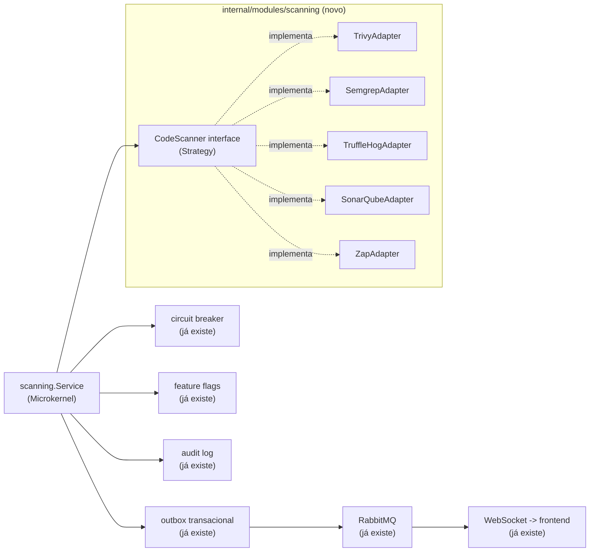

# Roadmap — SecOps Orchestrator: Trivy, Semgrep, TruffleHog, SonarQube e OWASP ZAP como parte do NIX Platform

- **Status:** Fase 1 (Fundação), Fase 3 (Trivy) e Fase 4 (Semgrep) implementadas — ver detalhes na
  seção "Fases" abaixo. Fase 2 (TruffleHog) foi pulada por decisão do usuário (redundante com o
  gitleaks já no CI). Fases 5+ (SonarQube, OWASP ZAP) seguem propostas; a decisão de qual atacar em
  seguida é do usuário.
- **Origem:** adaptação de uma proposta externa (Core em Go orquestrando ferramentas SecOps via
  Microkernel/Strategy/Adapter/Observer) para a arquitetura real deste repositório.
- **Revisão:** a primeira versão deste documento usava o módulo `secops`/VirusTotal como exemplo
  vivo de cada padrão já implementado. Esse módulo foi removido do produto (decisão do usuário —
  era a única integração "SecOps" real, e o rumo daqui pra frente é o orquestrador desenhado
  abaixo, não um provedor de lookup avulso). Os exemplos abaixo foram trocados para
  `diario_oficial`, o único módulo de integração restante — a arquitetura de plataforma que os
  patterns abaixo reaproveitam (outbox, circuit breaker, feature flags, auditoria) não mudou.

## Por que isto não é um "Core" novo — é uma extensão do que já existe

A proposta original pede um núcleo em Go do zero, gerenciando ferramentas de segurança como
plug-ins. O NIX Platform **já tem a espinha dorsal de plataforma** que isso precisa — o que não
existe mais é um exemplo vivo do papel específico de "Strategy" (não há mais um segundo provedor
plugável hoje, só `diario_oficial`, que fala com um único endpoint fixo) — mas a infraestrutura
em volta continua real e reaproveitável:

| Padrão pedido na proposta | Onde já existe no NIX Platform hoje |
|---|---|
| Strategy Pattern (interface comum por ferramenta) | ✅ Implementado: `scanning/domain/scanner.go` define `CodeScanner`, com `TrivyScanner` (Fase 3) como primeira implementação real registrada — não mais só o `fakeScanner` de teste. |
| Adapter Pattern (normalizar o output de cada ferramenta) | ✅ Implementado, dois adapters reais: `trivy_scanner.go` e `semgrep_scanner.go` traduzem o JSON de cada ferramenta pro `domain.Finding` unificado — mesmo princípio que `diario_oficial/infrastructure/http_client.go` já aplicava a um único parceiro. O que os dois têm em comum (clonar o alvo via git, validar SSRF) foi extraído pra `git_clone.go` em vez de duplicado. Cada scanner novo (Fase 5+) ganha seu próprio adapter no mesmo pacote. |
| Observer / Event-Driven | Outbox transacional + RabbitMQ (`internal/platform/outbox`, `internal/domain/events`) já publicam `integration.status.changed`, `diario_oficial.job.completed/failed` e, desde a Fase 1/3, `scanning.scan.completed`/`scanning.scan.failed` — o consumer real hoje é só o Hub de WebSocket (`nix.notification.websocket`); nenhuma reação automática a achados CRITICAL/HIGH existe ainda. |
| Microkernel / plug-in registry | ✅ Implementado: `scanning.Service` recebe `...domain.CodeScanner` no construtor e monta um `map[string]CodeScanner` internamente — registrar uma ferramenta nova (Fase 4+) é só passar mais um argumento no wiring de `internal/app/modules.go`, sem tocar em `RunScan`/`ProcessScanJob`. |
| Resiliência (timeout, circuit breaker) | `internal/platform/resilience` (circuit breaker) e `context.Context` com timeout já protegem toda chamada externa — o mesmo mecanismo cobre um scanner novo sem código extra. |
| Interruptor de emergência por ferramenta | `internal/platform/configflags` (feature flags em runtime) já desliga uma integração inteira sem reimplantar — `diario_oficial_scraping_enabled` é o exemplo vivo hoje; cada scanner novo ganha sua própria flag do mesmo jeito. |
| Auditoria de cada execução | `internal/platform/audit` (log imutável) já registra toda ação sensível — cada scan vira uma entrada de auditoria como qualquer outra. |

**A diferença real que exige código novo:** um lookup de "essa entidade é maliciosa? sim/não"
(o que o `secops` removido fazia) cabe num resultado único. Trivy/Semgrep/TruffleHog/SonarQube
devolvem uma **lista** de achados discretos (um scan pode encontrar 40 vulnerabilidades, cada
uma com seu próprio CVE/arquivo/linha/severidade) — um formato estruturalmente diferente, que a
interface `CodeScanner` da Fase 1 já nasce pensando nisso, em vez de tentar encaixar numa forma
de resultado único.

## Arquitetura adaptada

Novo módulo `internal/modules/scanning` (mesmo padrão de pastas de todo módulo já existente:
`domain/application/infrastructure/transport`), com sua própria tabela (`scan_findings`),
suas próprias permissões RBAC (`scanning:read`, `scanning:manage`, seguindo o padrão já usado —
ver `internal/platform/auth/rbac.go`) e reaproveitando toda a plataforma já construída — nada
disso é modificado, só consumido:



`CodeScanner` (a interface nova, Fase 1):

```go
package scanning

type Severity string

const (
    SeverityCritical Severity = "CRITICAL"
    SeverityHigh     Severity = "HIGH"
    SeverityMedium   Severity = "MEDIUM"
    SeverityLow      Severity = "LOW"
)

// Finding é o modelo unificado de achado — todo adaptador converte o
// formato nativo da sua ferramenta (JSON/XML/SARIF) pra isto.
type Finding struct {
    ID          string   // CVE-2026-XXXX, ou uma regra própria (ex.: "semgrep:go.lang.security.audit.sql-injection")
    OWASPCategory string // "A03:2021-Injection", etc. — ver o mapeamento abaixo
    Severity    Severity
    Description string
    File        string // vazio para achados que não são de arquivo (ex.: DAST)
    Line        int
}

// CodeScanner é o contrato que toda ferramenta de scanning implementa —
// desenhado desde já pra "lista de achados" (não um resultado único),
// já que é isso que Trivy/Semgrep/TruffleHog/SonarQube/ZAP produzem.
type CodeScanner interface {
    Name() string
    Execute(ctx context.Context, target string) ([]Finding, error)
}
```

## Fases

Cada fase entrega algo testável e revertível por conta própria — nenhuma depende de todas as
ferramentas estarem prontas para gerar valor.

**Fase 1 — Fundação (sem ferramenta externa nenhuma ainda) — ✅ implementada**
- Migration `scan_findings` (id, scanner, target, owasp_category, severity, description, file,
  line, created_at) — mesmo padrão das tabelas já existentes
  (`migrations/000014_scan_findings.sql`).
- Interface `CodeScanner` + modelo `Finding` (acima) — `scanning/domain/scanner.go`, junto com
  `Repository` (persistência dos achados).
- `scanning.Service` (Strategy + Microkernel): recebe `map[string]CodeScanner` (registrado no
  construtor, um `panic` em nome duplicado — erro de wiring, não condição de runtime), roda um
  scan e grava achados + evento de outbox `scanning.scan.completed` numa única transação
  (`scanning/application/service.go`).
  - **Desvio deliberado do texto acima**: `RunScan` é **síncrono**, não o mesmo desenho
    assíncrono job+outbox+worker de `diario_oficial.Service.CreateTestJob`. O padrão assíncrono
    existe para desacoplar uma requisição HTTP de uma operação lenta via fila — mas esta fase não
    cria nenhum endpoint HTTP nem consumer de fila (ver abaixo), então um job/worker aqui seria
    infraestrutura morta: mensagens publicadas que nada consome. `RunScan` grava achados + evento
    de outbox atomicamente e retorna direto, sem fila no meio. A Fase 2, ao introduzir o primeiro
    scanner real chamado a partir de um endpoint HTTP de verdade, é o momento certo de revisitar
    essa escolha.
- Testado inteiramente com um `fakeScanner`, do mesmo jeito que
  `diario_oficial/application/service_test.go` já testa contra Postgres real com um `fakeClient`
  — nenhuma ferramenta externa precisa estar instalada para esta fase passar no CI
  (`scanning/application/service_test.go`, pulado sem `TEST_DATABASE_URL`).
- RBAC: `scanning:read`/`scanning:manage` adicionadas a `rbac.go`, concedidas a
  `nix-integration-manager` (leitura+gestão) e `nix-auditor` (só leitura) — o mesmo par de roles
  que já cobre integrações, em vez de um role novo só para isto.
- Auditoria: `audit.ActionScanCompleted` (`"scan.completed"`) registrado a cada `RunScan` bem-sucedido — a Fase 3 completou o trio com `ActionScanRequested`/`ActionScanFailed` para o fluxo assíncrono (ver abaixo).
- **Deliberadamente fora desta fase** (chegou na Fase 3, junto com o primeiro scanner real): nenhum
  endpoint HTTP/transport, nenhuma fila/worker RabbitMQ, nenhuma UI no frontend, e o módulo
  `scanning` não estava conectado em `internal/app/modules.go` — sem nenhum `CodeScanner` real
  ainda, conectar um `Service` sem scanner nem chamador teria sido abstração morta (o mesmo
  raciocínio que levou à remoção completa do módulo `secops`/VirusTotal). Ver Fase 3 abaixo para
  onde cada uma dessas peças foi de fato construída.

**Fase 2 — TruffleHog (secret scanning) — ⏭️ pulada por decisão do usuário**
- O CI deste projeto já roda [gitleaks](https://github.com/gitleaks/gitleaks)
  (`.github/workflows/gitleaks.yml`) — a mesma categoria de ferramenta que o TruffleHog. Diante da
  redundância, o usuário escolheu explicitamente ir direto para a Fase 3 (Trivy) em vez de adotar
  TruffleHog e aposentar o gitleaks. Fica registrada como decisão tomada, não como observação em
  aberto — se algum dia fizer sentido revisitar (ex.: TruffleHog cobre verificação ativa contra
  provedores conhecidos, gitleaks só regex), é aqui que essa fase retomaria.

**Fase 3 — Trivy (dependências, Dockerfiles) — ✅ implementada**
- **A suposição original desta fase estava errada e foi corrigida durante a implementação**: o
  texto original assumia que dava pra "reaproveitar o mesmo binário/imagem" que o Trivy já usa no
  CI. Investigando antes de implementar, descobriu-se que isso não é viável em produção: o
  `backend-worker` roda numa imagem Alpine mínima sem o código-fonte do repositório, sem acesso ao
  daemon Docker, e o CI nunca publica as imagens construídas em nenhum registry — não há de onde
  ler um Dockerfile ou uma imagem em tempo de execução sem antes obter o código de algum lugar.
  Perguntado sobre isso, o usuário escolheu explicitamente: **clonar o alvo via git** para um
  diretório temporário no worker e rodar `trivy fs` nele — em vez de montar o socket do Docker
  (superfície de ataque equivalente a root no host) ou publicar imagens num registry (escopo maior
  antes do Trivy em si funcionar).
- `TrivyScanner` (`backend/internal/modules/scanning/infrastructure/trivy_scanner.go`): alvo é
  `"<url-git-https>[#branch-ou-tag]"` — só `https://` é aceito (bloqueia `file://`, que permitiria
  ler qualquer caminho local do worker, e `ssh://`, que exigiria gerenciar uma chave privada), e o
  prefixo obrigatório garante por construção que o valor nunca começa com `-`, prevenindo injeção
  de argumento no `git`/`trivy` via `os/exec` (nunca via shell, mas real do mesmo jeito). Roda
  `trivy fs --scanners vuln,misconfig` (sem `secret` — gitleaks já cobre essa categoria no CI,
  mesmo raciocínio que decidiu a Fase 2 acima). Verificado de ponta a ponta contra um repositório
  público real (`OWASP/NodeGoat`) com 86 achados reais parseados corretamente.
- **A10 SSRF, corrigido durante a implementação**: este endpoint é o primeiro da plataforma a
  aceitar uma URL do chamador (o `target` git) — `validateHost` resolve o hostname e rejeita
  qualquer IP privado/loopback/link-local/não especificado antes de clonar, para que
  `scanning:manage` não vire um jeito de sondar/alcançar hosts internos a partir do worker. Defesa
  em profundidade, não uma proteção completa (o `git`, um processo separado, re-resolve o host de
  novo ao conectar de verdade — uma resposta de DNS que mude entre a checagem e essa conexão
  passaria batido), aceita como suficiente hoje porque quem chama já precisa do mesmo nível de
  confiança de qualquer outra ação administrativa de integração na plataforma. Ver a linha A10 na
  tabela OWASP abaixo.
- `git` e `trivy` instalados só na imagem do `backend-worker` (nunca na do `backend-api`), com o
  binário do Trivy verificado por checksum SHA-256 contra o `checksums.txt` publicado pelo próprio
  projeto antes de instalar — integridade de supply chain (A08:2021) para a própria ferramenta de
  segurança que a plataforma orquestra.
- **Desvio deliberado do padrão síncrono da Fase 1**: com um scanner real e lento (clone + scan
  pode levar de segundos a minutos) chamado por HTTP de verdade, o par
  `CreateScanJob`/`ProcessScanJob` (mesmo desenho job+outbox+worker de
  `diario_oficial.Service.CreateTestJob`/`ProcessJob`) substitui a chamada síncrona só para o
  caminho HTTP — `RunScan` continua existindo, síncrono, para quem quiser chamar um scanner
  diretamente sem depender de fila (testes, uma futura execução agendada que já roda no worker).
  `POST /api/v1/scanning/scans` retorna 202 imediatamente; o `job_id` retornado é o mesmo `scan_id`
  usado depois em `GET /api/v1/scanning/scans/{scanID}/findings`.

**Fase 4 — Semgrep (SAST) — ✅ implementada**
- `SemgrepScanner` (`backend/internal/modules/scanning/infrastructure/semgrep_scanner.go`):
  exatamente como no exemplo da proposta original (`os/exec` chamando `semgrep scan --json`),
  convertendo pra `[]Finding`. Regras: `p/owasp-top-ten` (registry público, mantido pela
  comunidade Semgrep) como padrão, configurável via `SCANNING_SEMGREP_CONFIG`.
- **Reaproveitamento em vez de duplicação**: o mesmo alvo/mecânica do Trivy (clonar via git pra um
  diretório temporário) valia igualmente aqui — em vez de copiar `parseTarget`/`validateHost`
  (a defesa de SSRF da Fase 3) pro adapter novo, essa lógica foi extraída pra
  `git_clone.go`, compartilhada pelos dois scanners. Duplicar uma checagem de segurança em dois
  lugares é como ela diverge silenciosamente com o tempo — extrair antes do segundo uso evitou
  isso.
- **Duas descobertas reais ao integrar com a saída de verdade do Semgrep** (verificado rodando
  contra `OWASP/PyGoat`, um app Python deliberadamente vulnerável, não assumido da documentação):
  1. O campo `extra.metadata.owasp` tem **tipo inconsistente** entre regras da comunidade — às
     vezes uma lista de strings (`["A03:2021 - Injection", "A05:2025 - Injection"]`), às vezes uma
     string única (`"A06:2017 - Security Misconfiguration"`). `firstOWASPCategory` decodifica os
     dois formatos via `json.RawMessage`.
  2. `path` no resultado do Semgrep é **absoluto** (`/tmp/nix-scan-xxx/app.py`), ao contrário do
     `Target` do Trivy (já relativo) — `relativeToScanDir` corrige isso antes de gravar em
     `Finding.File`, pra nunca persistir um caminho efêmero que não significa nada fora da
     execução do scan.
- Severidade: o engine OSS do Semgrep só emite `ERROR`/`WARNING`/`INFO` (sem `CRITICAL` nativo,
  confirmado contra a saída real) — mapeado pra `HIGH`/`MEDIUM`/`LOW` respectivamente.
- `backend/Dockerfile.worker`: Python3 + pip + Semgrep instalados numa venv isolada só na imagem
  do worker. Diferença real de postura em relação ao Trivy, documentada no próprio Dockerfile: o
  Semgrep não publica um tarball com checksum próprio como o Trivy — a integridade aqui vem da
  cadeia padrão do pip contra o PyPI (TLS + hash por pacote), não de uma verificação explícita.
  Custo operacional real: a imagem do worker cresce de ~150MB pra **~916MB** com o runtime Python
  completo do Semgrep — aceito por ora; SonarQube (Fase 5) já é sinalizado como a fase de maior
  custo de infraestrutura da lista, mas o Semgrep também não é gratuito nesse sentido.

**Fase 5 — SonarQube (qualidade de código, bugs)**
- **Maior custo de infraestrutura da lista**: exige um servidor SonarQube rodando (self-hosted
  via Docker Compose, ou SonarCloud). Avaliar esse custo operacional antes de começar — é a
  única fase que não é "só chamar um binário."

**Fase 6 — OWASP ZAP (DAST)**
- **Maior risco de todas as fases**: dispara ataques ativos contra um alvo rodando de verdade.
  Regra inegociável: `ZapAdapter` só pode apontar para ambientes de homologação/staging,
  nunca produção — reforçado por uma allowlist de hosts no próprio Core (o mesmo princípio do
  Gateway Pattern que a proposta cita para mitigar A10/SSRF, aplicado aqui na direção inversa:
  não deixar o próprio scanner virar um vetor de ataque contra o alvo errado).

**Fase 7 — Orquestração concorrente**
- Rodar scanners independentes em paralelo via goroutines + `errgroup`, com timeout por
  `context.Context` cancelando um scanner que trava sem derrubar os outros — o mesmo raciocínio
  que já rege o circuit breaker existente, estendido para paralelismo.

**Fase 8 — CLI + CI/CD**
- Um subcomando novo (`cmd/secscan`, mesmo padrão de `cmd/api`/`cmd/worker`) chamável como
  `nix-secscan scan --repo .` — usado tanto localmente quanto no `ci.yml`, unificando o que hoje
  são 4 jobs de CI separados (govulncheck, npm audit, Trivy, gitleaks/CodeQL) atrás de uma única
  interface, sem remover nenhum deles.

**Fase 9 — Frontend**
- Uma aba nova em `/integracoes` (ou uma seção própria) listando achados recentes por severidade
  — reaproveitando `IntegrationCard`/`StatusIndicator`/o padrão de Server Component já em uso em
  todo o resto do dashboard, não um design novo.

## Mapeamento OWASP Top 10 — o que já é real hoje vs. o que este roadmap adiciona

| Risco | Já implementado no NIX Platform hoje | O que este roadmap adiciona |
|---|---|---|
| A01 Broken Access Control | RBAC por permissão (`RequirePermission`), rotas sensíveis protegidas | ZAP testando fuzzing de IDs em staging (Fase 6) |
| A02 Cryptographic Failures | RS256 próprio pro login local, bcrypt, segredos via `_FILE`, HSTS | — (já coberto; scanners não mudam isso) |
| A03 Injection | 100% consultas parametrizadas via pgx (conferido nesta sessão: zero concatenação de string em SQL) | ✅ Semgrep (`p/owasp-top-ten`, taint analysis) via `POST /api/v1/scanning/scans` (Fase 4) |
| A04 Insecure Design | Monólito modular com fronteiras de módulo, ADRs documentando decisão de arquitetura | — (prática de engenharia, não uma ferramenta) |
| A05 Security Misconfiguration | CSP com nonce, headers de segurança, containers non-root | ✅ Trivy (`--scanners misconfig`) varrendo Dockerfiles sob demanda, via `POST /api/v1/scanning/scans` (Fase 3) |
| A06 Vulnerable Components | govulncheck + npm audit + Trivy (imagens) + Dependabot, todos já no CI | ✅ Trivy (`--scanners vuln`) sob demanda contra qualquer repositório git, fora do CI (Fase 3) |
| A07 Auth Failures | Bloqueio de conta, rate limit distribuído, erro genérico (sem enumeração de usuário) | ZAP testando o ciclo de vida de sessão em staging (Fase 6) |
| A08 Software & Data Integrity | Idempotência, outbox transacional, CI builda a partir do código-fonte | Nenhuma assinatura/SBOM ainda — gap real, não coberto por nenhuma fase acima; ficaria fora de escopo deste roadmap |
| A09 Logging & Monitoring | Audit log imutável, logs estruturados correlacionados por request id, Prometheus, OpenTelemetry | `scanning.scan.completed` como mais um evento auditado (Fase 1) |
| A10 SSRF | ⚠️ Desde a Fase 3, `POST /api/v1/scanning/scans` (target de `trivy` **e**, desde a Fase 4, `semgrep` — mesma validação compartilhada via `git_clone.go`) É um endpoint que aceita uma URL do chamador — `validateHost` resolve o host e rejeita IP privado/loopback/link-local/não especificado antes de clonar, defesa em profundidade (não uma proteção completa contra DNS rebinding, já que o `git` re-resolve o host ao conectar; aceito hoje porque quem chama já precisa de `scanning:manage`). Todo outro endpoint continua sem aceitar URL arbitrária. | ✅ Semgrep (Fase 4) já roda contra os próprios módulos da plataforma sob demanda — detectaria um cliente HTTP com URL não validada se esse padrão aparecesse no futuro |

## Fora de escopo deste roadmap

- Assinatura digital de artefatos / SBOM (A08) — mencionado na proposta original, mas é um
  projeto à parte (ferramenta tipo `cosign`/`syft`), não uma fase natural deste orquestrador.
- Qualquer execução automática deste roadmap nesta sessão — este documento é o planejamento;
  implementação começa quando o usuário escolher uma fase.
